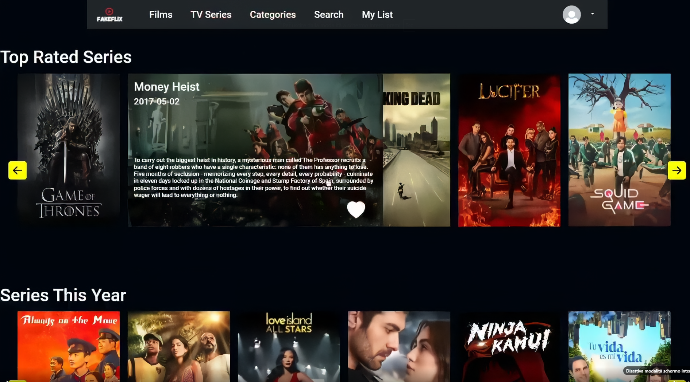

# Fakeflix
<h2 style="text-align:center;">Italiano</h2>
Clone di Netflix-PrimeVideo.
Progetto creato con React, redux, react-router-dom, slick-carousel (Bootstrap + Css personalizzato). Costruito con TMBD api.  
Per visualizzare il progetto dopo aver scaricato i file la prima cosa da fare è andare su <a href="https://developer.themoviedb.org/reference/intro/getting-started" target="_blank">TMBD Api</a>, crearti un account gratuito e inserire la key gratuita che ti arriverà per email. La key andrà sostituita alla scritta ApiKey nel file FetchTrend.jsx

 <h4>Homepage:</h4>

Nella homepage troverai i film più recenti. Passando il mouse sopra un'immagine, questa si allargherà, permettendoti di visualizzare ulteriori dettagli sul film, in basso a destra dell'immagine troverai un cuore bianco, cliccandoci inserirai il film nella tua lista preferiti che troverai nella pagina MyList. Cliccando sull'immagine, verrai reindirizzato alla pagina dedicata al singolo film.
<h4>Films:</h4>

Nella pagina Films nel primo carosello troverai alcuni film più apprezzati, mentre nel secondo troverai alcuni dei film usciti quest'anno.Passando il mouse sopra un'immagine, questa si allargherà, permettendoti di visualizzare ulteriori dettagli sul film in basso a destra dell'immagine troverai un cuore bianco, cliccandoci inserirai il film nella tua lista preferiti che troverai nella pagina MyList. Cliccando sull'immagine, verrai reindirizzato alla pagina dedicata al singolo film.
<h4>TV Series:</h4>

Nella pagina TvSeries nel primo carosello troverai alcune delle serie tv più apprezzate, mentre nel secondo troverai alcune serie tv uscite quest'anno.Passando il mouse sopra un'immagine, questa si allargherà, permettendoti di visualizzare ulteriori dettagli sulla serie tv,in basso a destra dell'immagine troverai un cuore bianco, cliccandoci inserirai la serie tv nella tua lista preferiti che troverai nella pagina MyList. Cliccando sull'immagine, verrai reindirizzato alla pagina dedicata alla singola serie tv.
<h4>Categories:</h4>

Nella pagina Categories per prima cosa dovrai scegliere se visualizzare le categorie dei film, o delle serie tv. Ora visualizzerai tutte le categorie possibili, clicca su una categoria e visualizzerai una lista di film appartenti a quella categoria.Passando il mouse sopra un'immagine, questa si allargherà, permettendoti di visualizzare ulteriori dettagli sul film o serie tv da te scelta. Cliccando sull'immagine, verrai reindirizzato alla pagina dedicata al singolo film o serie tv da te scelta.
<h4>Search:</h4>

Nella pagina Search per prima cosa dovrai scegliere se vuoi cercare un film o una serie tv. Ora inserisce il nome di un film o serie tv che vuoi cercare e clicca su Search Movie/TVSeries e visualizzerai la lista di tutti i film o serie tv da te cercata.Cliccando su See Details verrai reindirizzato alla pagina dedicata al singolo film o serie tv da te scelta.
<h4>MyList:</h4>

Nella pagina MyList troverai la lista completa di tutti i film o serietv che hai inserito nella tua lista preferiti cliccando il cuore bianco. Cliccando sulla i nella casella See Detail verrai reindirizzato alla pagina dedicata al singolo film o serie tv da te scelta. Invece cliccando sull'icona del cestino nella casella Eliminate, eliminerai il film o serietv dalla tua lista dei preferiti
My personal clone of Netflix-PrimeVideo.
React Project with redux react-router-dom slick-carousel (Bootstrap + personal Css).Developed with TMBD api
